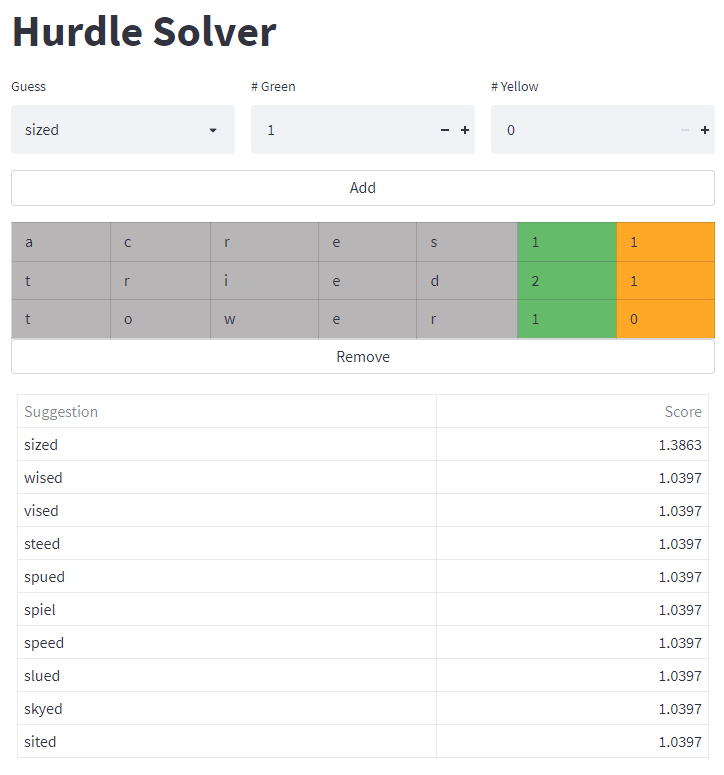

# Hurdle Solver 
This application aims at helping to beat [Hurdle](https://playhurdle.vercel.app), 
which is a [Wordle](https://www.nytimes.com/games/wordle/index.html) meets 
[Mastermind](https://en.wikipedia.org/wiki/Mastermind_(board_game)) game.

For more implementation details please refer to my [blog post](https://colinschepers.github.io/2023/hurdlesolver/).

You can check out the application by **clicking the screenshot below**.

<a href="https://share.streamlit.io/colinschepers/hurdlesolver"></a>

## Installation
1. Make sure Python 3.8 is installed
2. Run the following command to install the requirements
```shell script
pip install -r requirements.txt
```

## Run Dashboard
Run the Streamlit Dashboard with the following command. 

```shell script
streamlit run streamlit_app.py
```

## Run Script
To start a new solving session in the console run the command below.
```shell script
python main.py
```

You can provide additional information when starting a solving session using arguments in triplets (guess, num_green, num_yellow):
```shell script
python main.py cones 1 2 nears 0 2
```
